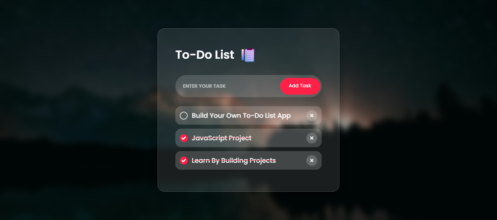

# 📝 To-Do List App with HTML, CSS & JavaScript  

A beginner-friendly **To-Do List App** built using **HTML, CSS, and JavaScript**.  
This project helps you practice **JavaScript DOM manipulation, event handling, and local storage** while creating a modern **Glassmorphism UI**.  

---

## 🚀 Features  
✔️ Add new tasks easily  
✔️ Mark tasks as completed  
✔️ Delete tasks with one click  
✔️ Save tasks in **Local Storage** (data persists after refresh)  
✔️ Responsive Glassmorphism design  

---

## 🛠️ Tech Stack  
- **HTML5** – Structure  
- **CSS3** – Modern styling with Glassmorphism  
- **JavaScript (ES6)** – Functionality + Local Storage  

---

## 📂 Project Setup  

1. Clone the repository:  
   ```bash
   git clone https://github.com/your-username/todo-list-app.git
2. Open the folder in your code editor (e.g., VS Code).
3. Run the project:
   Either open index.html directly in your browser
   Or use the Live Server extension in VS Code

📸 Screenshots



## 📚 What You’ll Learn

🔹 How to build a **To-Do List app** from scratch  
🔹 Handling **user input** with JavaScript  
🔹 Toggling **task completion dynamically**  
🔹 Using **Local Storage** to save data  
🔹 Designing a **clean responsive UI** with Glassmorphism  

---

## 🤝 Contributing

Contributions are always welcome!  

1. **Fork** the project  
2. **Create a new branch** (`feature-branch`)  
3. **Commit** your changes  
4. **Push** to your fork & open a **Pull Request**  

---

## 📜 License

This project is licensed under the **MIT License**.  

---

⭐ Don’t forget to **star this repo** if you like it!  

Made with ❤️ using **HTML, CSS, and JavaScript**.
